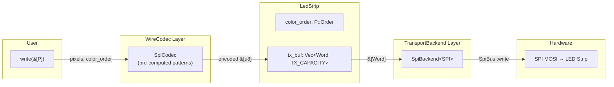
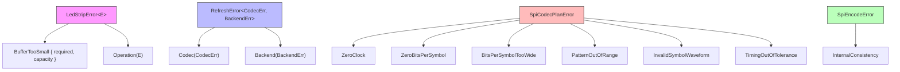

# led-strip Driver Architecture

> **Version**: 0.2.0 &emsp; **Edition**: Rust 2024 &emsp; **MSRV**: 1.88

## 1. Overview

`led-strip` is a `no_std` embedded Rust driver for single-wire addressable LED strips
(WS2812B, SK6812, WS2811, WS2816). All buffers are statically allocated at compile
time — zero heap, zero alloc.

### Design Pillars

| Pillar | Realization |
|---|---|
| **Zero-cost abstraction** | Generic `<P, Proto, Codec, Backend>` monomorphized per strip instance; no dyn dispatch |
| **Compile-time safety** | `<pixel, protocol>` mismatch rejected at compile time; TX_CAPACITY checked on each write |
| **Extensible backend** | `WireCodec`/`TransportBackend` traits are protocol- and peripheral-agnostic |
| **Branch-free hot path** | SPI patterns are pre-computed at construction; `encode` loop is a tight bit-packing kernel |

---

## 2. Architecture Overview



**Pipeline**:
1. User calls `write(pixels)` with a dynamic-length pixel slice.
2. `LedStrip::write()` calls `Codec::encode(pixel_count, color_order, pixels, &mut tx_buf)`.
3. `Backend::transmit(tx_buf)` pushes the byte stream to the peripheral.
4. The codec appends **reset (latch) fill bytes** at the end — the backend is oblivious to protocol timing.

---

## 3. Module Map

| File | Purpose | Key Exports |
|---|---|---|
| `lib.rs` | Crate root, module declarations, re-exports, doc overview | — |
| `api.rs` | Core traits (`WireCodec`, `TransportBackend`) and `LedStrip` struct | `LedStrip`, `RefreshError` |
| `protocol.rs` | `SingleWireProtocol` trait + 4 protocol markers | `Ws2812B`, `Ws2811`, `Sk6812`, `Ws2816`, `BitOrder`, `PulseTiming` |
| `pixel.rs` | `LedPixel` trait + 3 pixel types + color-order enums | `Rgb`, `Rgbw`, `Rgb16`, `RgbOrder`, `RgbwOrder`, `Rgb16Order` |
| `spi.rs` | SPI codec (bit-banging encoder) + SPI backend | `SpiCodec`, `SpiBackend`, `SpiEncodingPlan`, `TimingEdge`, `SpiCodecPlanError` |
| `error.rs` | Unified error type | `LedStripError`, `LedStripResult` |

### Feature Gates

| Feature | Default | Dep | Description |
|---|---|---|---|
| `spi` | ✅ | `embedded-hal` | Enables `SpiCodec` + `SpiBackend` |

The crate compiles without `spi` (for testing the core types), but no backend is available.

---

## 4. Core Traits

### 4.1 `LedPixel` — Sealed Pixel Abstraction

```rust
pub trait LedPixel: Copy + Default + private::Sealed {
    type Order: Copy + Eq;          // RgbOrder | RgbwOrder | Rgb16Order
    const KIND: PixelKind;          // runtime discriminant
    const BYTES_PER_PIXEL: usize;   // 3 | 4 | 6
    fn encode(self, order: Self::Order, out: &mut [u8]);
}
```

The trait is **sealed** — downstream crates cannot add new pixel types. This ensures the `<pixel, protocol>` impl matrix stays closed and auditable.

| Pixel Type | Channels | Wire Bytes | Protocols |
|---|---|---|---|
| `Rgb { r, g, b }` | 3× u8 | 3 | Ws2812B, Ws2811 |
| `Rgbw { r, g, b, w }` | 4× u8 | 4 | Sk6812 |
| `Rgb16 { r, g, b }` | 3× u16 | 6 | Ws2816 |

### 4.2 `SingleWireProtocol<P>` — Electrical Characteristics

```rust
pub trait SingleWireProtocol<P: LedPixel> {
    const NAME: &'static str;
    const BIT_ORDER: BitOrder;           // MsbFirst | LsbFirst
    const DEFAULT_COLOR_ORDER: P::Order;
    const RESET_NS: u32;
    const ZERO: PulseTiming;             // { high_ns, low_ns }
    const ONE: PulseTiming;
    const TIMING_TOLERANCE_NS: u32;      // default 150 ns
}
```

Each protocol is a **zero-sized marker type** that encodes datasheet constants as associated consts. The `<P, Proto>` pair is checked at compile time — only these 4 combinations exist:

| Protocol | Pixel | Bit Rate | Color Order | Reset |
|---|---|---|---|---|
| `Ws2812B` | `Rgb` | ~800 kbps | GRB | ≥50 µs |
| `Ws2811` | `Rgb` | ~400 kbps | RGB | ≥50 µs |
| `Sk6812` | `Rgbw` | ~800 kbps | GRBW | ≥80 µs |
| `Ws2816` | `Rgb16` | ~800 kbps | GRB | ≥300 µs |

### 4.3 `WireCodec<P, Proto, Word>` — Encoding Strategy

```rust
pub trait WireCodec<P: LedPixel, Proto: SingleWireProtocol<P>, Word: Copy> {
    type Error;
    type EncodeError;  // separated from Error; SpiCodec::EncodeError = SpiEncodeError

    fn encoded_len(&self, pixel_count: usize) -> usize;
    fn encode<const TX_CAPACITY: usize>(
        &self,
        pixel_count: usize,
        color_order: P::Order,
        pixels: &[P],
        out: &mut Vec<Word, TX_CAPACITY>,
    ) -> LedStripResult<(), Self::EncodeError>;
}
```

- `encoded_len` **must** return the exact byte count `encode` will produce (including reset). Used for capacity pre-check in `encode`.
- `encode` writes into a caller-supplied `heapless::Vec` — no allocation.
- `Error` (static) vs `EncodeError` (per-encode) separation: `SpiCodec::Error = SpiCodecPlanError` covers construction/validation failures; `SpiCodec::EncodeError = SpiEncodeError` covers encode-time failures (pixel-count mismatch, internal-consistency checks).

### 4.4 `TransportBackend` — Wire Transmission

```rust
pub trait TransportBackend {
    type Word: Copy;     // u8 for SPI; u32 for RMT/PIO
    type Error;           // SPI::Error, etc.

    fn transmit(&mut self, words: &[Self::Word]) -> Result<(), Self::Error>;
}
```

Backends are **stateless** beyond the peripheral handle. The codec is responsible for reset timing and protocol encoding — the backend only pushes words.

---

## 5. `LedStrip` — Stateless Driver

```rust
pub struct LedStrip<P, Proto, Codec, Backend, const TX_CAPACITY: usize>
where
    P: LedPixel,
    Proto: SingleWireProtocol<P>,
    Codec: WireCodec<P, Proto, Backend::Word>,
    Backend: TransportBackend,
{
    color_order: P::Order,
    codec: Codec,
    backend: Backend,
    tx_buf: Vec<Backend::Word, TX_CAPACITY>,
    _proto: PhantomData<Proto>,
}
```

### Type Parameters

| Parameter | Role | Example |
|---|---|---|
| `P` | Pixel type | `Rgb`, `Rgbw`, `Rgb16` |
| `Proto` | Protocol marker | `Ws2812B`, `Sk6812` |
| `Codec` | Encoding scheme | `SpiCodec` |
| `Backend` | Transport layer | `SpiBackend<MySpi>` |
| `TX_CAPACITY` | Max transport buffer (words) | `1024` |

### Public API

| Method | Signature | Description |
|---|---|---|
| `new` | `(color_order, codec, backend) → Self` | Constructs driver (no capacity validation) |
| `write` | `(&[P]) → Result<(), …>` | Encodes pixel slice and transmits to strip in one call |
| `into_parts` | `(self) → (Codec, Backend)` | Destructure for reuse |

### Capacity Model

Capacity checks happen on each `write()` call:

```rust
// Encoded_len validates that pixel_count fits in TX_CAPACITY
// If it doesn't, encode returns BufferTooSmall
```

The `encoded_len` method returns the exact word count needed for `pixel_count` pixels (payload + reset). `write()` checks this against `TX_CAPACITY` before encoding — the error path is cold but provides a safe panic-free fallback.

---

## 6. SPI Backend Deep Dive

### 6.1 `SpiEncodingPlan`

```rust
pub struct SpiEncodingPlan {
    spi_hz: u32,             // SPI clock (e.g. 2_400_000)
    zero_pattern: u8,        // bit pattern for logical 0 (e.g. 0b100)
    one_pattern: u8,         // bit pattern for logical 1 (e.g. 0b110)
    bits_per_symbol: u8,     // SPI bits per protocol bit (e.g. 3)
    extra_reset_ns: u32,     // additional reset padding
}
```

**Predefined Plans**:

| Plan | SPI Clock | Symbol Width | Zero Pattern | One Pattern | Use Case |
|---|---|---|---|---|---|
| `ws281x_3bit()` | 2.4 MHz | 3 | `0b100` | `0b110` | WS2812B, WS2811 |
| `sk6812_4bit()` | 3.2 MHz | 4 | `0b1000` | `0b1100` | SK6812 |

**Timing Derivation** (example: ws281x_3bit @ 2.4 MHz):
```
spi_bit_ns = 10⁹ / 2_400_000 ≈ 416 ns

zero_pattern = 0b100 → leading_ones = 1 → T0H = 1 × 416 = 416 ns, T0L = 2 × 416 = 833 ns
one_pattern  = 0b110 → leading_ones = 2 → T1H = 2 × 416 = 833 ns, T1L = 1 × 416 = 416 ns
```

### 6.2 `SpiCodec`

Pre-computes at construction time:

| Field | Normal | Inverted |
|---|---|---|
| `zero_pattern` | `0b100` | `0b011` |
| `one_pattern` | `0b110` | `0b001` |
| `reset_fill` | `0x00` | `0xFF` |

**Construction**:
- `SpiCodec::new(plan, invert)` — structural validation only
- `SpiCodec::for_protocol::<P, Proto>(plan, invert)` — structural + timing tolerance validation

### 6.3 Encoding Algorithm

The `encode()` method implements a **streaming bit-packing kernel**:

```
for each pixel:
    pixel.encode(color_order) → raw bytes [b₀, b₁, …]
    for each byte:
        for bit_index in 0..8:
            shift = msb_first ? (7 - bit_index) : bit_index
            pattern = (byte >> shift) & 1 ? one_pattern : zero_pattern
            append_pattern(out, pattern, bits_per_symbol)
// flush partial byte
append reset_fill bytes (calculated from RESET_NS + extra_reset_ns)
```

`append_pattern` accumulates SPI bits into a `u8` accumulator. When 8 bits are buffered, the byte is pushed and the accumulator resets. This is the **hot path** — called for every protocol bit, but has zero branches on pattern selection (pre-computed) and zero bounds checks on push (capacity verified upfront).

### 6.4 Reset Byte Calculation

```
total_reset_ns = Proto::RESET_NS + plan.extra_reset_ns
reset_bytes = ⌈total_reset_ns × spi_hz / (8 × 10⁹)⌉
```

Uses ceiling division via `(scaled_cycles + 8e9 - 1) / 8e9` to avoid floating-point.

### 6.5 `SpiBackend<SPI>`

```rust
pub struct SpiBackend<SPI> { spi: SPI }

impl<SPI: SpiBus<u8>> TransportBackend for SpiBackend<SPI> {
    type Word = u8;
    type Error = SPI::Error;
    fn transmit(&mut self, words: &[u8]) -> Result<(), SPI::Error> {
        self.spi.write(words)
    }
}
```

Minimal wrapper — delegates directly to `embedded_hal::spi::SpiBus::write`. Provides `into_inner()` / `inner()` / `inner_mut()` for peripheral reuse.

### 6.6 Timing Validation

`validate_timing::<P, Proto>(plan)` checks all 4 edges against the protocol's `TIMING_TOLERANCE_NS` (±150 ns default):

```
for each edge ∈ {T0H, T0L, T1H, T1L}:
    if |actual_ns - expected_ns| > tolerance_ns:
        return Err(TimingOutOfTolerance { edge, actual_ns, expected_ns, tolerance_ns })
```

This catches mismatches like plugging a WS2812B plan into an SK6812 strip at construction time.

---

## 7. Error Hierarchy



### Error flow in `write()`:

1. `Codec::encode` returns `LedStripResult<(), EncodeError>`.
2. `BufferTooSmall` errors propagate directly from capacity checks.
3. Codec-specific errors (`Operation(EncodeError)`) are wrapped into `RefreshError::Codec`.
4. `Backend::transmit` errors are wrapped into `RefreshError::Backend`.
5. `map_operation` allows wrapping codec/backend errors into `RefreshError` while preserving structural variants.

---

## 8. Data Flow: `write(pixels)`

```mermaid
sequenceDiagram
    participant User
    participant LedStrip
    participant SpiCodec
    participant tx_buf
    participant SpiBackend
    participant SPI as SPI Peripheral
    participant Strip as LED Strip

    User->>LedStrip: write(&[Rgb::new(255,0,0); 60])
    LedStrip->>SpiCodec: encode(60, Grb, pixels, &mut tx_buf)
    SpiCodec->>SpiCodec: for each pixel byte:<br/>lookup 0/1 pattern<br/>bit-pack into SPI bytes
    SpiCodec->>tx_buf: append reset fill bytes
    SpiCodec-->>LedStrip: Ok(())
    LedStrip->>SpiBackend: transmit(tx_buf.as_slice())
    SpiBackend->>SPI: spi.write(&[u8])
    SPI-->>Strip: MOSI → DIN (all pixels + latch)
    SpiBackend-->>LedStrip: Ok(())
    LedStrip-->>User: Ok(())
```

---

## 9. Capacity Planning

The single const generic requires upfront sizing:

### `TX_CAPACITY`

```
TX_CAPACITY ≥ ceil(pixel_count × bytes_per_pixel × 8 × bits_per_symbol / 8) + reset_bytes
```

**Examples** (ws281x_3bit, 2.4 MHz):

| Pixels | Frame Bytes | Payload SPI Bytes | Reset Bytes | TX_CAPACITY (min) |
|---|---|---|---|---|
| 1 | 3 | 9 | 15 | 24 |
| 60 | 180 | 540 | 15 | 555 |
| 256 | 768 | 2304 | 15 | 2319 |

For SK6812 (4-bit, 3.2 MHz), multiply payload by 4/3 and add larger reset:
| Pixels | TX_CAPACITY (approx) |
|---|---|
| 60 | ~990 |

**Rule of thumb**: `TX_CAPACITY = max_pixel_count × 10` for ws281x_3bit, `max_pixel_count × 17` for sk6812_4bit — then round up to the nearest power of 2 for headroom.

---

## 11. Future Backends (RMT, PIO)

The `WireCodec` / `TransportBackend` traits are intentionally generic and **not** tied to SPI:

### RMT (Remote Control Transceiver — ESP32)

```
RmtCodec: WireCodec<P, Proto, u32>
  → encodes pixels → RMT pulse pairs (level, duration_ticks)
  → handles reset splitting (15-bit HW limit per RMT item)
  → encoded_len predicts exact RMT item count

RmtBackend: TransportBackend<Word = u32>
  → owns rmt::Channel
  → transmit() pumps items into RMT FIFO
```

### PIO (Programmable I/O — RP2040/2350)

```
PioCodec: WireCodec<P, Proto, u32>
  → encodes pixels → 32-bit PIO FIFO words
  → PIO state machine handles bit-banging in hardware

PioBackend: TransportBackend<Word = u32>
  → owns PIO SM instance
  → transmit() DMA-pushes words to TX FIFO
```

### Integration path

To add a new backend:
1. Implement `WireCodec<P, Proto, YourWord>` for your codec.
2. Implement `TransportBackend<Word = YourWord>` for your backend.
3. Gate behind a Cargo feature (`rmt`, `pio`).
4. Add `#[cfg(feature = "…")]` module + re-export in `lib.rs`.

No changes to `LedStrip` or the protocol/pixel layers are needed — the generic design absorbs new backends transparently.

---

## 12. Test Strategy

All tests are `#[cfg(test)]` inline unit tests — no external test harness required.

| Module | Test Count | Key Coverage |
|---|---|---|
| `api.rs` | 9 | `RefreshError` Display/Error, `LedStrip` lifecycle (new/write/into_parts/Debug), `BufferTooSmall` check, zero-pixel reset |
| `error.rs` | 8 | Display for all variants, `Error::source()`, `From<E>`, `convert()` widening, `map_operation` both branches |
| `pixel.rs` | 20 | All 3 pixel types: constructors, BLACK/WHITE, Default, all color-order encode paths, KIND, BYTES_PER_PIXEL |
| `spi.rs` | 38 | Timing validation (pass/fail/boundary/cross-protocol), all 4 protocol encodings, encode round-trip, invert_output, extra_reset_ns, plan getters, SpiCodec::new, SpiBackend (new/inner/into_inner/inner_mut/transmit via mock SPI), all 5 plan validation error paths |
| **Total** | **75** | |

The remaining uncovered regions are all in **unreachable paths** (safety nets and future-extension branches):

| File | Unreachable Paths |
|---|---|
| `spi.rs` | Overflow branches in `encoded_len` / `reset_bytes` (billions of pixels needed), cold push/resize error paths after capacity pre-check, `bit_shift` LsbFirst (no protocol uses it) |
| `api.rs` | `write()` encode-error mapping arms (all pre-validated by `encoded_len` capacity check) |
| `error.rs` | `Display` for `LedStripError<Infallible>` operation variant (infallible, never constructed) |

These paths exist as safety nets (e.g., overflow returns `usize::MAX` to fail the capacity check gracefully) and for future protocol support.

---

## 13. Dependency Tree

```
led-strip
├── heapless 0.9        (always — Vec for static buffers)
└── embedded-hal 1.0    (optional, feature = "spi")
    └── spi::SpiBus<u8> (used by SpiBackend)
```

No other runtime dependencies. `no_std` compatible (except test builds).

---

## 14. Coding Conventions

- **`#[must_use]`** on all fallible constructors (`new`, `for_protocol`) and pure getters.
- **`const fn`** where possible — all config constructors, pattern masks, convenience builders.
- **`debug_assert!`** for invariants that are guaranteed by the type system but worth double-checking in debug builds.
- **`From` impls** for error conversions to avoid boilerplate `map_err` chains.
- **Sealed trait** pattern on `LedPixel` to prevent downstream impls.
- **Zero-sized protocol markers** — no runtime cost, all dispatch via monomorphization.
- **Separated error types**: `Error` (static/construction) ≠ `EncodeError` (per-operation). This allows codecs that never fail at encode time to use `EncodeError = Infallible` (dead branches eliminated by the compiler), while codecs like `SpiCodec` that perform runtime validation (pixel-count mismatch, capacity edge-cases) use a concrete `EncodeError` type.
